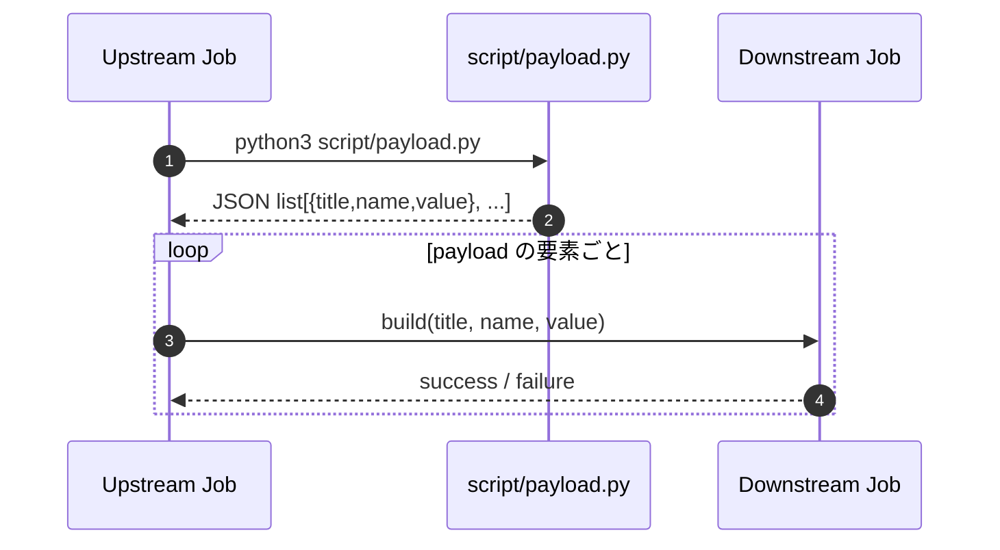

# Jenkins Job 連携ナレッジ（Upstream -> Downstream）

このREADMEは、`SPEC.md` の要件を満たす最小実装を **Jenkinsで再現するための手順書** です。  
仕様の基準は `SPEC.md` を参照してください。

## 1. 目的
- Upstream ジョブから Downstream ジョブを起動する
- `script/payload.py` の出力（辞書のリスト）をパラメータとして Downstream に渡す
- リスト件数ぶん Downstream を繰り返し実行する

## 2. 構成ファイル
- `Jenknis-upstream`  
  Upstream の Jenkins Pipeline 定義
- `Jenkins-downstream`  
  Downstream の Jenkins Pipeline 定義
- `script/payload.py`  
  `title`, `name`, `value` を持つ JSON 配列を出力するスクリプト
- `SPEC.md`  
  要件仕様

## 3. 連携フロー（シーケンス図）

## 4. 前提条件
- Jenkins で Pipeline ジョブを作成できること
- Jenkins Agent で Docker が実行可能であること（`agent { docker { image ... } }` を利用）
- 本リポジトリを Jenkins からチェックアウトできること

## 5. 実装方法（Jenkins設定）

### 5.1 Downstream ジョブ作成
1. Jenkins で Pipeline ジョブを新規作成  
   例: `pipeline-child-downstream`
2. Pipeline Script に `Jenkins-downstream` の内容を設定
3. 保存

Downstream は以下3パラメータを受け取ります。
- `title`
- `name`
- `value`

### 5.2 Upstream ジョブ作成
1. Jenkins で Pipeline ジョブを新規作成  
   例: `pipeline-child-upstream`
2. Pipeline Script に `Jenknis-upstream` の内容を設定
3. `build(job: 'pipeline-child-downstream', ...)` のジョブ名が、実際の Downstream ジョブ名と一致していることを確認
4. 保存

Upstream は以下を実施します。
- `python3 script/payload.py` を実行
- JSON をパースして配列であることを検証
- 要素ごとに `build(...)` で Downstream を起動

ログ出力に関する注意:
- `payload.py` の `stdout` は Upstream が JSON を受け取るためのチャネルです
- そのためログは `stderr` に出力し、`stdout` を JSON のみに保つ実装にしています

## 6. 使い方
1. `pipeline-child-upstream` を実行
2. Upstream ログで `payload.py` 実行後に Downstream が順次起動されることを確認
3. Downstream の各ビルドログで、`title/name/value` が表示されることを確認

`script/payload.py` の現在のサンプルは3要素なので、Downstream は3回実行されます。

## 7. 想定される実行結果
- Upstream: 成功
- Downstream: payload 件数ぶん成功（例: 3件）
- Downstream ログ例:
  - `received title=first, name=alice, value=10`
  - `received title=second, name=bob, value=20`
  - `received title=third, name=charlie, value=30`

## 8. トラブルシュート
- `payload.py returned empty output`  
  `payload.py` が空文字を返している
- `payload.py output must be a JSON list`  
  JSONのトップレベルが配列ではない
- `payload index X is missing key: ...`  
  配列要素に `title/name/value` のいずれかが不足している
- Downstream 側 `... is required`  
  パラメータが空で渡されている

## 9. カスタマイズポイント
- Downstream ジョブ名を変更する場合  
  `Jenknis-upstream` の `build(job: '...')` を更新
- 渡すデータを増やす場合  
  1. `script/payload.py` にキーを追加  
  2. `Jenkins-downstream` の `parameters` を追加  
  3. `Jenknis-upstream` の `build(parameters: ...)` を追加

## 10. 補足
- `Jenknis-upstream` はファイル名が `Jenkins` ではなく `Jenknis` です（現状のリポジトリ定義に合わせています）
- 本READMEは実装・運用の手順書、仕様の正本は `SPEC.md` です
